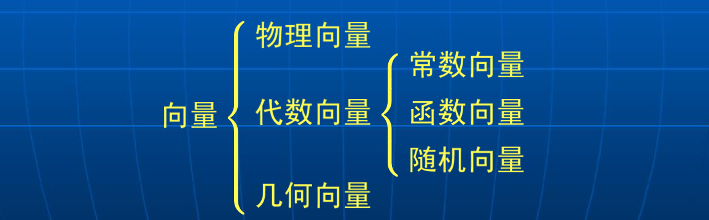

# 矩阵概述及前言

[TOC]

## 前言

人工智能是指研究、开发用于模拟、延伸和扩展生物智能解决问题的理论、方法和应用系统。

关于人工智能的解释，人工智能就是根据人们对人脑工作机制的研究成果，了解人的智能的实质，然后建立相应的数学模型、设计求解算法，并用计算机软硬件实现，从而生产出一种新的智能机器，能以人类智能相似的方式做出反应，胜任一些通常需要人类智能才能完成的复杂工作。

虽然人工智能取得了一些进步，但与真正的智能还相去甚远。人工智能现在最大的缺陷是没有理论，基本上还处在实验科学阶段，其进一步发展的瓶颈也就是缺乏理论指导。人工智能是一门交叉学科，融合了脑认知科学、心理学、数学(包括统计学)、信息 科学、计算机科学等诸多学科。

矩阵论不仅仅是人工智能的基础，更是现代数学和以现代数学作为主要分析方法的众多学科的基 础，从量子力学到图像处理都离不开向量和矩阵的使用。

向量和矩阵是代数、特别是线性代数的主要工具。线性代数是人工智能技术的一个基础的工具集。另外，机器学习的主要研究内容—数据再表达中的主成分分析方法，包括K-L变换、主成分分析( 可以看成是K-L变换的一个应用)、奇异值分解等都是线性代数的基本内容。

## 向量、矩阵

矩阵的符号表示：
$$
\begin{aligned}
&\boldsymbol{A} \in \mathbb{R}^{m \times n} \Leftrightarrow \boldsymbol{A}=\left(a_{i j}\right)=\left[\begin{array}{ccc}
a_{11} & \cdots & a_{1 n} \\
\vdots & & \vdots \\
a_{m 1} & \cdots & a_{m n}
\end{array}\right], \quad a_{i j} \in \mathbb{R} \\
&\boldsymbol{A} \in \mathbb{C}^{m \times n} \Leftrightarrow \boldsymbol{A}=\left(a_{i j}\right)=\left[\begin{array}{ccc}
a_{11} & \cdots & a_{1 n} \\
\vdots & & \vdots \\
a_{m 1} & \cdots & a_{m n}
\end{array}\right], \quad a_{i j} \in \mathbb{C}
\end{aligned}
$$
当 $m = n$ 时，称矩阵A为正方矩阵(square matrix)；若 $m <
n$，则称矩阵A为宽矩阵(broad matrix)；当 $m>n$ 时，便称矩阵A是高矩阵(high matrix)。若 $n=1$，则$a\in
C^m$ 为列向量；若 $m= 1$，则$a\in C^{1\times n}$ 为行向量。

向量的分类：

- 物理向量：泛指既有幅值，又有方向的物理量，如速度、加速度、位移等。
- 几何向量：为了将物理向量可视化，常用带方向的（简称有向）线段表示之。这种有向线段称为几何向量。
- 代数向量：几何向量可以用代数形式表示。

实际中得到的往往是物理向量，几何向量是物理向量的可视化，而代数向量则可视为物理向量的运算化工具。

## 矩阵的性能指标

在数学中经常只使用一个数或标量概括多变量情况，其中矩阵的性能指标就是这类典型例子。

### 范数

范数(norm)：数学中的一种基本概念。在泛函分析中，它定义在赋范线性空间中，并满足一定的条件，即①非负性；②齐次性；③三角不等式。它常常被用来度量某个向量空间(或矩阵)中的每个向量的长度或大小。矩阵范数还规定其必须满足相容性，所以矩阵范数通常也称为相容范数。

1. 对于任何非零矩阵 $A \neq O$，其范数都大于0，即 $\|A\|>0$.
2. 对任意复数 $c$，有 $\|cA\| = |c|\|A\|$.
3. 矩阵范数满足三角不等式：$\|A + B\|\leq \|A\| +\|B\|$.
4. 两个矩阵乘积的范数小于等于两个矩阵范数的乘积：$\|AB\| \leq \|A\| \cdot \|B\|$.

最常用的矩阵范数为Frobenius范数：
$$
\|\boldsymbol{A}\|_{\mathrm{F}} \stackrel{\text { def }}{=}\left(\sum_{i=1}^{m} \sum_{j=1}^{n}\left|a_{i j}\right|^{2}\right)^{1 / 2}
$$
矩阵的Frobenius范数也称为Euclidean范数、Schur范数、$l_2$ 范数。

### 二次型函数

...

### 行列式

定义：
$$
\operatorname{det}(\boldsymbol{A})=|\boldsymbol{A}|=\left|\begin{array}{cccc}
a_{11} & a_{12} & \cdots & a_{1 n} \\
a_{21} & a_{22} & \cdots & a_{2 n} \\
\vdots & \vdots & & \vdots \\
a_{n 1} & a_{n 2} & \cdots & a_{n n}
\end{array}\right|
$$
矩阵 $A$ 去掉第 $i$ 行和第 $j$ 列之后得到的剩余行列式记作 $A_{ij}$，称为元素 $a_{ij}$ 的余子式。

行列式的计算公式：
$$
\begin{aligned}
\operatorname{det}(\boldsymbol{A}) &=a_{i 1} A_{i 1}+a_{i 2} A_{i 2}+\cdots+a_{i n} A_{i n} \\
&=\sum_{j=1}^{n} a_{i j}(-1)^{i+j} \operatorname{det}\left(\boldsymbol{A}_{i j}\right)
\end{aligned}
$$

$$
\begin{aligned}
\operatorname{det}(\boldsymbol{A}) &=a_{1 j} A_{1 j}+a_{2 j} A_{2 j}+\cdots+a_{n j} A_{n j} \\
&=\sum_{i=1}^{n} a_{i j}(-1)^{i+j} \operatorname{det}\left(\boldsymbol{A}_{i j}\right)
\end{aligned}
$$

定义：行列式不等于零的矩阵称为非奇异矩阵。作为一个性能指标，矩阵的行列式主要刻画矩阵的奇异性。

### 特征值

...

### 迹

对于 ![[公式]](https://www.zhihu.com/equation?tex=A+%5Cin+R%5En%2CA+%3D+%28a_%7Bij%7D%29)

- ![[公式]](https://www.zhihu.com/equation?tex=tr%28A%29+%3D+%5Csum_%7Bi+%3D+1%7D%5En+a_%7Bii%7D)
- ![[公式]](https://www.zhihu.com/equation?tex=tr%28A%29+%3D+tr%28A%5E%7B%5Cprime%7D%29)
- ![[公式]](https://www.zhihu.com/equation?tex=tr%28kA%29+%3D+ktr%28A%29)
- ![[公式]](https://www.zhihu.com/equation?tex=tr%28A%2BB%29+%3D+tr%28A%29%2Btr%28B%29)
- ![[公式]](https://www.zhihu.com/equation?tex=tr%28AB%29+%3D+tr%28BA%29)

对矩阵迹的求导：

- ![[公式]](https://www.zhihu.com/equation?tex=%5Cfrac%7B%5Cpartial+tr%28X%29%7D%7B%5Cpartial+X%7D+%3D+I)
- ![[公式]](https://www.zhihu.com/equation?tex=%5Cfrac%7B%5Cpartial+tr%28g%28X%29%29%7D%7B%5Cpartial+X%7D+%3D+g%5E%7B%5Cprime%7D%28x%29)
- ![[公式]](https://www.zhihu.com/equation?tex=%5Cfrac%7B%5Cpartial+tr%28AXB%29%7D%7B%5Cpartial+X%7D+%3D+BA)
- ![[公式]](https://www.zhihu.com/equation?tex=%5Cfrac%7B%5Cpartial+tr%28X%5En%29%7D%7B%5Cpartial+X%7D+%3D+nX%5E%7Bn-1%7D)
- ![[公式]](https://www.zhihu.com/equation?tex=%5Cfrac%7B%5Cpartial+tr%28AX%5En%29%7D%7B%5Cpartial+X%7D+%3D+%5Csum_%7Bi+%3D+1%7D%5E%7Bn-1%7DX%5EiAX%5E%7Bn-i-1%7D)
- ![[公式]](https://www.zhihu.com/equation?tex=%5Cfrac%7B%5Cpartial+tr%28AXBX%5ETC%29%7D%7B%5Cpartial+X%7D+%3D+B%5ETX%5ETA%5ETC%5ET+%2B+BX%5ETCA)

(最后一个的证明)

### 秩

定理1：在 $p$ 维(行或列)向量的集合之中，最多存在 $p$ 个线性无关的(行或列)向量。

定理2：矩阵 $A_{m \times n}$ 的线性无关行数与线性无关列数相同。

定义：矩阵 $A_{m \times n}$ 的秩定义为该矩阵中线性无关的行和列的数目。

关于矩阵 $A$ 的秩的下列叙述**等价**：

- $rank(A)= k$
- 存在 $A$ 的 $k$ 列且不多于 $k$ 列组成一线性无关组
- 存在 $A$ 的 $k$ 行且不多于 $k$ 行组成一线性无关组
- 存在 $A$ 的一个 $k\times k$ 子矩阵具有非零行列式，而且 $A$ 的所有$(k+ 1) \times (k+1)$ 子矩阵都具有零行列式

秩的**主要性质**：

- 秩是一个正整数
- 秩等于或小于矩阵的行数或列数
- 当 $n \times n$ 矩阵 $A$ 的秩等于 $n$ 时，则 $A$ 是非奇异矩阵，或称 $A$ 满秩(full rank)
- 如果 $rank(A_{m \times n}) < \min(m,n)$， 则称 $A$ 是秩亏缺的(rank deficient)。一个秩亏缺的正方矩阵称为奇异矩阵。
- 如果 $rank(A_{m \times n})  =  m(<n)$， 则称 $A$ 具有行满秩
- 如果 $rank(A_{m \times n})  =  n(<m)$， 则称 $A$ 具有列满秩
- 任何矩阵 $A$ 左乘满列秩矩阵或者右乘满行秩矩阵后，矩阵 $A$ 的秩保持不变。

秩的等式与不等式关系:

- $\operatorname{rank}(\boldsymbol{A} \boldsymbol{B}) \leqslant \min \{\operatorname{rank}(\boldsymbol{A}), \operatorname{rank}(\boldsymbol{B})\}$
- $\operatorname{rank}\left(\boldsymbol{A}^{\mathrm{H}}\right)=\operatorname{rank}\left(\boldsymbol{A}^{\mathrm{T}}\right)=\operatorname{rank}\left(\boldsymbol{A}^{*}\right)=$ $\operatorname{rank}(\boldsymbol{A})$
- $\operatorname{rank}(c \boldsymbol{A})=\operatorname{rank}(\boldsymbol{A})$

作为一个性能指标，矩阵的秩刻画矩阵行与行之间或者列与列之间的线性无关性，从而反映矩阵的满秩性和秩亏缺性。

## 矩阵的逆

### 逆矩阵

...

### 广义逆矩阵

...

### Moore-Penrose逆矩阵

...

## 拉直和Kronecker积

矩阵拉直：记 $X = (x_1,\cdots,x_p)$ 是 $n \times p$ 的矩阵。矩阵拉直运算就是将矩阵按照列向量拉直为向量，拉直后的向量记为 $vec(X)$，有
$$
vec(X) = (x_1^T,\cdots,x_p^T)^T
$$
Kronecker积：令 $A = (a_{ij})_{n \times p}$ 和 $B$ 分别为 $n \times p$ 和 $m \times q$ 的矩阵。 

矩阵 $A$ 和 $B$ 的Kronecker 积记作 $A \otimes B$，有
$$
A \otimes B = (a_{ij}B)
$$
  性质：

- 对任意实数$\lambda$，有 $(\lambda A)\otimes B = A \otimes (\lambda B) = \lambda (A \otimes B)$
- $A \otimes (B+C) = A \otimes B +A \otimes C,(B+C)\otimes A = B \otimes A + C \otimes A$.
- $(A \otimes B) \otimes C = A \otimes (B \otimes C)$
- $(A \otimes B)^{\prime} = (A^{\prime} \otimes B^{\prime})$
- $(A \otimes B)(C \otimes D) = (AC) \otimes (BD)$
- 若A、B都是非奇艺的方阵，则 $(A \otimes B)^{-1} = A^{-1} \otimes B^{-1}$
- $tr(A \otimes B) = tr(A)·tr(B)$
- $tr(A^{\prime}B) = (vec(A))^{\prime}(vec(B))$
- $vec(AYB) = (B^{\prime}\otimes A)vec(Y)$

## Hadamard积

...