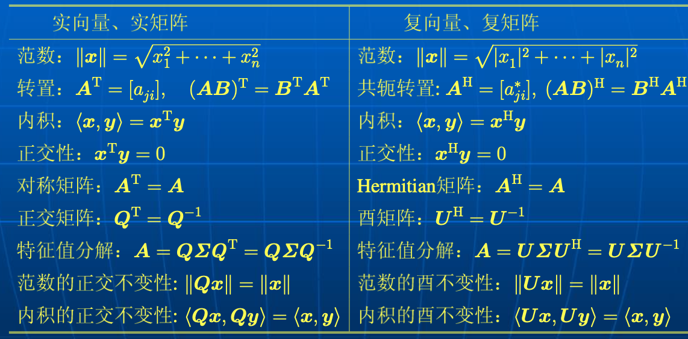

# 特殊矩阵

[TOC]

## 基本矩阵

基本矩阵的定义：一个 $m \times n$ 维基本矩阵可以用 $m
\times 1$ 基本向量
与 $n\times 1$ 基本向量的外积定义 $E_{ij}^{(m \times n)} = e_i^{(m)}(e_j^{(n)})^T$.

其中的 $e_i^{(m)}$ 表示一个仅第 $i$ 个元素等于1，其他元素全部是 0 的 $m$ 维基本向量。

在这种定义下，基本矩阵具有以下性质：

- $\boldsymbol{E}_{i k}^{(m \times n)} \boldsymbol{E}_{j l}^{(n \times r)}=\delta_{k j} \boldsymbol{E}_{i l}^{(m \times r)}$
- $\boldsymbol{A}=\sum_{i=1}^{m} \sum_{k=1}^{n} a_{i k} \boldsymbol{E}_{i k}^{(m \times n)}$
- $\boldsymbol{E}_{i k}^{(s \times p)} \boldsymbol{A} \boldsymbol{E}_{m n}^{(q \times r)}=a_{k m} \boldsymbol{E}_{i n}^{(s \times r)}$
- $\left(\boldsymbol{E}_{i k}^{(m \times n)}\right)^{\mathrm{T}}=\boldsymbol{E}_{k i}^{(n \times m)}$
- $\operatorname{det}\left(\boldsymbol{E}_{i j}^{(m \times n)}\right)=0$

## 置换矩阵

置换矩阵：一个正方矩阵称为置换矩阵(permutation matrix)，若它的每一行和每一列有一个且仅有一个非零元素1。将矩阵的各列进行重排(置换)。

用置换矩阵左乘矩阵 $A$ 相当于将 $A$ 的行进行重排，右乘矩阵 $A$ 相当于将 $A$ 的列进行重排。

置换矩阵另外有三种特殊形式：交换矩阵、互换矩阵、移位矩阵。

交换矩阵：

存在一个唯一的 $mn \times mn$的置换矩阵，使得：$K_{mn} vec(A)=vec(A^T) $，称之为交换矩阵。

互换矩阵：
$$
\boldsymbol{J}=\left[\begin{array}{llll}
0 & & & 1 \\
& & 1 & \\
& \therefore & & \\
1 & & & 0
\end{array}\right]
$$
通过左乘和右乘，互换矩阵 $J$ 可以将一矩阵的行或列的顺序反转(互换)。

移位矩阵：
$$
\boldsymbol{P}=\left[\begin{array}{ccccc}
0 & 1 & 0 & \cdots & 0 \\
0 & 0 & 1 & \cdots & 0 \\
\vdots & \vdots & \vdots & \ddots & \vdots \\
0 & 0 & 0 & \cdots & 1 \\
1 & 0 & 0 & \cdots & 0
\end{array}\right]
$$
移位矩阵是因其能够使别的矩阵的首行或者最后一 列移动位置而得名。例如，对一个 $m \times n$ 矩阵 $\boldsymbol{A}$, 若左乘 $m \times m$ 移位矩阵 $\boldsymbol{P}_{m}$，则
$$
\boldsymbol{P}_{m} \boldsymbol{A}=\left[\begin{array}{cccc}
a_{21} & a_{22} & \cdots & a_{2 n} \\
a_{31} & a_{32} & \cdots & a_{3 n} \\
\vdots & \vdots & & \vdots \\
a_{m 1} & a_{m 2} & \cdots & a_{m n} \\
a_{11} & a_{12} & \cdots & a_{1 n}
\end{array}\right]
$$

## 正交矩阵与酉矩阵

定义：一实的正方矩阵 $\boldsymbol{Q} \in R^{n \times n}$ 称为正交矩 阵, 若
$$
\boldsymbol{Q} \boldsymbol{Q}^{\mathrm{T}}=\boldsymbol{Q}^{\mathrm{T}} \boldsymbol{Q}=\boldsymbol{I}
$$
一复值正方矩阵 $U \in C^{n \times n}$ 称为酉矩阵, 若
$$
\boldsymbol{U} \boldsymbol{U}^{\mathrm{H}}=\boldsymbol{U}^{\mathrm{H}} \boldsymbol{U}=\boldsymbol{I}
$$
半正交矩阵(semi-orthogonal matrix)：只满 足 $\boldsymbol{Q} \boldsymbol{Q}^{\mathrm{T}}=\boldsymbol{I}_{m}$ 或者 $\boldsymbol{Q}^{\mathrm{T}} \boldsymbol{Q}=\boldsymbol{I}_{n}$ 的矩阵 $\boldsymbol{Q}_{m \times n^{\circ}}$
仿酉矩阵(para-unitary matrix)：只满足 $\boldsymbol{U} \boldsymbol{U}^{\mathrm{H}}=\boldsymbol{I}_{m}$ 或者 $\boldsymbol{U}^{\mathrm{H}} \boldsymbol{U}=\boldsymbol{I}_{n}$ 的复矩阵 $\boldsymbol{U}_{m \times n}$ 。

**酉矩阵的等价叙述**

若 $U \in C^{n \times n}$，则下列叙述等价：

- $U$ 是酉矩阵
- $U$ 是非奇异的, 并且 $U^{\mathrm{H}}=U^{-1}$
- $U U^{\mathrm{H}}=U^{\mathrm{H}} U=I$
- $U^{\mathrm{H}}$ 是酉矩阵
- $\boldsymbol{U}=\left[\boldsymbol{u}_{1}, \boldsymbol{u}_{2}, \cdots, \boldsymbol{u}_{n}\right]$ 的列组成标准正交组，即

$$
\boldsymbol{u}_{i}^{\mathrm{H}} \boldsymbol{u}_{j}=\delta(i-j)= \begin{cases}1, & i=j \\ 0, & i \neq j\end{cases}
$$
- $U$ 的行组成标准正交组
- 对所有 $\boldsymbol{x} \in C^{n}$ 而言, $\boldsymbol{y}=\boldsymbol{U} \boldsymbol{x}$ 的Euclidean长度 与 $x$ 的Euclidean 长度相同, 即 $y^{\mathrm{H}} y=x^{\mathrm{H}} x$ 

## 中心化矩阵

...

## 相似矩阵

相似矩阵的定义：矩阵 $\boldsymbol{B} \in C^{n \times n}$ 称为矩阵 $\boldsymbol{A} \in$ $C^{n \times n}$ 的相似矩阵，若存在一非奇异矩阵 $\boldsymbol{S} \in$ $C^{n \times n}$ 使得 $\boldsymbol{B}=\boldsymbol{S}^{-1} \boldsymbol{A} \boldsymbol{S}$ 。此时，线性变换 $\boldsymbol{A} \mapsto$ $S^{-1} A S$ 称为矩阵 $A$ 的相似变换。关系“$B$ 相似 于 $\boldsymbol{A}$”常简写作 $\boldsymbol{B} \sim \boldsymbol{A}$ 。

相似矩阵的性质：

- 自反性：$\boldsymbol{A} \sim \boldsymbol{A}$, 即任一矩阵与它自己相似
- 对称性：若 $\boldsymbol{A}$ 相似于 $\boldsymbol{B}$, 则 $\boldsymbol{B}$ 相似于 $\boldsymbol{A}$ 
- 传递性：若 $\boldsymbol{A} \sim \boldsymbol{B}$ 和 $\boldsymbol{B} \sim \boldsymbol{C}$, 则 $\boldsymbol{A} \sim \boldsymbol{C}$

### 命题1

相似矩阵的行列式相等, 并具有相同的迹。

证明：对相似关系 $B=S^{-1} A S$ 分别运用行列式的性质, 得
$$
\begin{aligned}
\operatorname{det}(\boldsymbol{B}) &=\operatorname{det}\left(\boldsymbol{S}^{-1} \boldsymbol{A} \boldsymbol{S}\right) \\
&=\operatorname{det}\left(\boldsymbol{S}^{-1}\right) \operatorname{det}(\boldsymbol{A}) \operatorname{det}(\boldsymbol{S}) \\
&=\operatorname{det}(\boldsymbol{A}) \operatorname{det}\left(\boldsymbol{S}^{-1}\right) \operatorname{det}(\boldsymbol{S}) \\
&=\operatorname{det}(\boldsymbol{A}) \operatorname{det}\left(\boldsymbol{S}^{-1} \boldsymbol{S}\right) \\
&=\operatorname{det}(\boldsymbol{A}) \operatorname{det}(\boldsymbol{I}) \\
&=\operatorname{det}(\boldsymbol{A})
\end{aligned}
$$
利用迹的性质，又有
$$
\operatorname{tr}(\boldsymbol{B})=\operatorname{tr}\left(\boldsymbol{S}^{-1} \boldsymbol{A} \boldsymbol{S}\right)=\operatorname{tr}\left(\boldsymbol{A} \boldsymbol{S} \boldsymbol{S}^{-1}\right)=\operatorname{tr}(\boldsymbol{A})
$$
### 命题2

相似矩阵的特征多项式相同。

证明：对任意 $z$，有
$$
\begin{aligned}
\operatorname{det}(\boldsymbol{B}-z \boldsymbol{I}) &=\operatorname{det}\left(\boldsymbol{S}^{-1} \boldsymbol{A} \boldsymbol{S}-z \boldsymbol{S}^{-1} \boldsymbol{S}\right) \\
&=\operatorname{det}\left(\boldsymbol{S}^{-1}(\boldsymbol{A}-z \boldsymbol{I}) \boldsymbol{S}\right) \\
&=\operatorname{det}\left(\boldsymbol{S}^{-1}\right) \operatorname{det}(\boldsymbol{A}-z \boldsymbol{I}) \operatorname{det}(\boldsymbol{S}) \\
&=(\operatorname{det}(\boldsymbol{S}))^{-1} \operatorname{det}(\boldsymbol{S}) \operatorname{det}(\boldsymbol{A}-z \boldsymbol{I}) \\
&=\operatorname{det}(\boldsymbol{A}-z \boldsymbol{I})
\end{aligned}
$$
若一个矩阵的特征值定义为该矩阵的特征多项式的根，则相似矩阵具有相同的特征值。

## Vandermonde矩阵

定义：每行(或列)的元素组成一个等比序列的矩阵称为Vandermonde矩阵，即
$$
\boldsymbol{A}=\left[\begin{array}{ccccc}
1 & x_{1} & x_{1}^{2} & \cdots & x_{1}^{n-1} \\
1 & x_{2} & x_{2}^{2} & \cdots & x_{2}^{n-1} \\
\vdots & \vdots & \vdots & & \vdots \\
1 & x_{n} & x_{n}^{2} & \cdots & x_{n}^{n-1}
\end{array}\right]
$$
或
$$
\boldsymbol{A}=\left[\begin{array}{cccc}
1 & 1 & \cdots & 1 \\
x_{1} & x_{2} & \cdots & x_{n} \\
x_{1}^{2} & x_{2}^{2} & \cdots & x_{n}^{2} \\
\vdots & \vdots & & \vdots \\
x_{1}^{n-1} & x_{2}^{n-1} & \cdots & x_{n}^{n-1}
\end{array}\right]
$$

### 应用1

插值问题...

### 应用2

信号恢复...

## Fourier矩阵

离散时间信号 $x(0), x(1), \cdots, x(N-1)$ 的Fourier变换称为离散Fourier变换 (DFT)，定义为
$$
\hat{x}(k)=\sum_{n=0}^{N-1} x(n) \mathrm{e}^{-\mathrm{j} 2 \pi n k / N}=\sum_{n=0}^{N-1} x(n) w^{n k}, \quad k=0,1, \cdots, N-
$$
写成矩阵形式，有
$$
\left[\begin{array}{c}
\hat{x}(0) \\
\hat{x}(1) \\
\vdots \\
\hat{x}(N-1)
\end{array}\right]=\left[\begin{array}{ccccc}
1 & 1 & 1 & \cdots & 1 \\
1 & w & w^{2} & \cdots & w^{N-1} \\
\vdots & \vdots & \vdots & & \vdots \\
1 & w^{N-1} & w^{2(N-1)} & \cdots & w^{(N-1)(N-1)}
\end{array}\right]\left[\begin{array}{c}
x(0) \\
x(1) \\
\vdots \\
x(N-1)
\end{array}\right.
$$
简记作 $\hat{x}=F x$，其中 $F$ 称为Fourier矩阵。式中
$$
\begin{aligned}
&\boldsymbol{x}=[x(0), x(1), \cdots, x(N-1)]^{\mathrm{T}} \\
&\hat{\boldsymbol{x}}=[\hat{x}(0), \hat{x}(1), \cdots, \hat{x}(N-1)]^{\mathrm{T}}
\end{aligned}
$$
分别是离散时间信号向量和其频谱向量(一个信号的Fourier变换常称为该信号的频谱)。
用 $\boldsymbol{F}^{\mathrm{H}}$ 左乘 $\hat{\boldsymbol{x}}=\boldsymbol{F} \boldsymbol{x}$，并利用 $\boldsymbol{F}^{\mathrm{H}} \boldsymbol{F}=(1 / N) \boldsymbol{I}$，立即有
$$
\boldsymbol{x}=\frac{1}{N} \boldsymbol{F}^{\mathrm{H}} \hat{\boldsymbol{x}}
$$
即是说，信号的Fourier变换与Fourier反变换均可用Fourier矩阵表示。上述Fourier变换对称为非对称Fourier变换对。

## Hadamard矩阵

所有元素取 $+1$ 或者 $-1$，并且满足
$$
\boldsymbol{H}_{n} \boldsymbol{H}_{n}^{\mathrm{T}}=\boldsymbol{H}_{n}^{\mathrm{T}} \boldsymbol{H}_{n}=n \boldsymbol{I}_{n}
$$
的 $n \times n$ 矩阵称为Hadamard矩阵。

注释：

- 用 $-1$ 乘Hadamard矩阵的任意一行或者任意一列的元素，得到的结果仍然为一Hadamard矩阵。于是，可以得到第1列和第1行的所有元素为 $+1$ 的Hadamard矩阵，并称之为规范化Hadamard矩阵。

- 容易验证 $\frac{1}{\sqrt{n}} \boldsymbol{H}_{n}$ 为标准正交矩阵。

### 定理1

 令 $n=2^{k}, k=1,2, \cdots$, 则规范化的标准正交Hadamard矩阵具有通用构造公式：
$$
\begin{aligned}
&\boldsymbol{H}_{2 n}=\frac{1}{\sqrt{2}}\left[\begin{array}{ll}
\boldsymbol{H}_{n} & \boldsymbol{H}_{n} \\
\boldsymbol{H}_{n} & -\boldsymbol{H}_{n}
\end{array}\right] \\
&\boldsymbol{H}_{2}=\frac{1}{\sqrt{2}}\left[\begin{array}{cc}
1 & 1 \\
1 & -1
\end{array}\right]
\end{aligned}
$$
哈达玛矩阵在信息处理，加工分析中有重要应用(叫做离散的傅里叶分析)。也在通信的编码领域有相当大的应用，也可应用在小波变化和量子计算中。