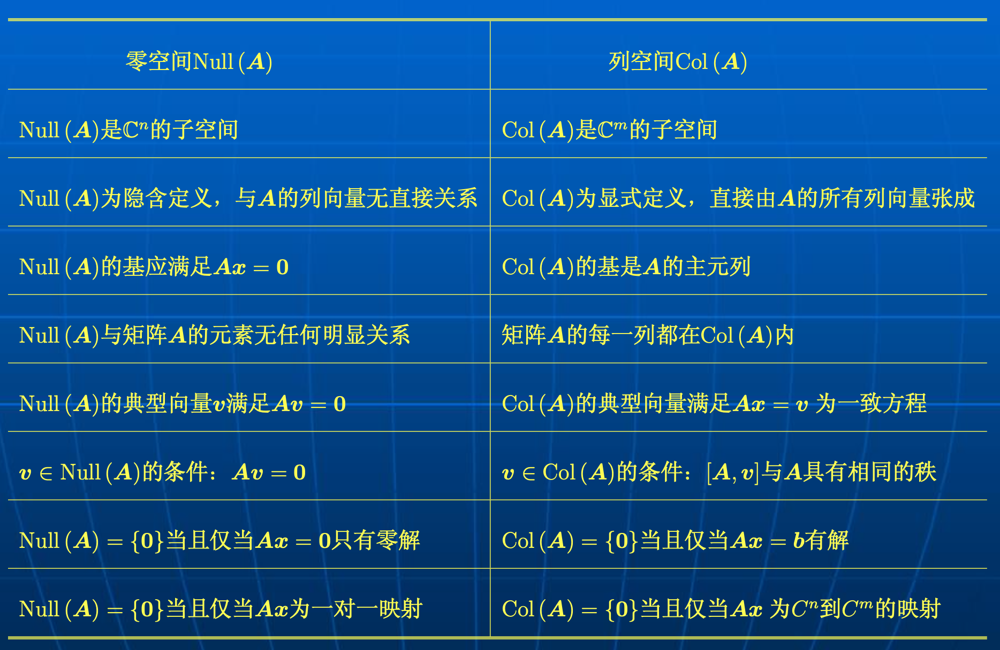

# 子空间方法

[>>前往教程目录](guide-matrix.md)

[TOC]

## 子空间一般理论

### 线性空间

...（暂略）

### 张成集定理和子空间的基

...（暂略）

### 子空间之间的关系

...（暂略）

### 子空间的夹角和距离

...（暂略）

## 列空间、行空间与零空间

### **基本子空间**

对于矩阵 $A \in C^{m \times n}$，其 m 个行向量和 n 个列向量分别记做
$$
\begin{aligned} \boldsymbol{r}_{1} &=\left[a_{11}, a_{12}, \cdots, a_{1 n}\right] \\ \boldsymbol{r}_{2} &=\left[a_{21}, a_{22}, \cdots, a_{2 n}\right] \\ & \vdots \\ \boldsymbol{r}_{m} &=\left[a_{m 1}, a_{m 2}, \cdots, a_{m n}\right] \end{aligned}
$$

$$
\boldsymbol{a}_{1}=\left[\begin{array}{c}a_{11} \\ a_{21} \\ \vdots \\ a_{m 1}\end{array}\right], \quad \boldsymbol{a}_{2}=\left[\begin{array}{c}a_{12} \\ a_{22} \\ \vdots \\ a_{m 2}\end{array}\right], \quad \cdots, \quad \boldsymbol{a}_{n}=\left[\begin{array}{c}a_{1 n} \\ a_{2 n} \\ \vdots \\ a_{m n}\end{array}\right]
$$

那么矩阵 $A = [a_1,a_2,\cdots,a_n] \in C^{m \times n}$ 的列空间定义为列向量的所有线性组合的集合：
$$
\begin{aligned} \operatorname{Col}(\boldsymbol{A}) &=\operatorname{Span}\left\{\boldsymbol{a}_{1}, \boldsymbol{a}_{2}, \cdots, \boldsymbol{a}_{n}\right\} \\ &=\left\{\boldsymbol{y} \in \mathbb{C}^{m}: \boldsymbol{y}=\sum_{j=1}^{n} \alpha_{j} \boldsymbol{a}_{j}: \alpha_{j} \in \mathbb{C}\right\} \end{aligned}
$$
同理，矩阵 A 的行空间定义为其复共轭行向量的所有线性组合的集合：
$$
\begin{aligned} \operatorname{Row}(\boldsymbol{A}) &=\operatorname{Span}\left\{\boldsymbol{r}_{1}^{*}, \boldsymbol{r}_{2}^{*}, \cdots, \boldsymbol{r}_{m}^{*}\right\} \\ &=\left\{\boldsymbol{y} \in \mathbb{C}^{n}: \boldsymbol{y}=\sum_{i=1}^{m} \beta_{i} \boldsymbol{r}_{i}^{*}: \beta_{i} \in \mathbb{C}\right\} \end{aligned}
$$
我们还需要给出下面几个定义：

- 矩阵 $A \in C^{m \times n}$ 的值域：

$$
\operatorname{Range}(\boldsymbol{A})=\left\{\boldsymbol{y} \in \mathbb{C}^{m}: \boldsymbol{A} \boldsymbol{x}=\boldsymbol{y}, \quad \boldsymbol{x} \in \mathbb{C}^{n}\right\}
$$

- 矩阵 $A \in C^{m \times n}$ 的零空间（也叫核）：

$$
\operatorname{Null}(\boldsymbol{A})=\operatorname{Ker}(\boldsymbol{A})=\left\{\boldsymbol{x} \in \mathbb{C}^{n}: \boldsymbol{A} \boldsymbol{x}=\mathbf{0}\right\}
$$

- 复矩阵 $A_{m \times n}$ 的的共轭转置 $A^H$ 的零空间定义为：

$$
\operatorname{Null}\left(\boldsymbol{A}^{\mathrm{H}}\right)=\operatorname{Ker}\left(\boldsymbol{A}^{\mathrm{H}}\right)=\left\{\boldsymbol{x} \in \mathbb{C}^{m}: \boldsymbol{A}^{\mathrm{H}} \boldsymbol{x}=\mathbf{0}\right\}
$$

- 零空间的维数称为 $A$ 的零化维度或零度：

$$
\operatorname{nullity}(\boldsymbol{A})=\operatorname{dim}[\operatorname{Null}(\boldsymbol{A})]
$$

我们称这四个为矩阵 $A$ 的四个基本子空间：列空间、行空间、零空间 $\operatorname{Null}(\boldsymbol{A})$ 和 $\operatorname{Null}(\boldsymbol{A}^{\mathrm{H}})$。

### 四个基本子空间之间的关系

- 矩阵A的值域与其列空间相等：
  $$
  \operatorname{Range}(\boldsymbol{A})=\operatorname{Col}(\boldsymbol{A})=\operatorname{Span}\left\{\boldsymbol{a}_{1}, \boldsymbol{a}_{2}, \cdots, \boldsymbol{a}_{n}\right\}
  $$

- 矩阵A的行空间与 $A^H$​ 的列空间相等：
  $$
  \operatorname{Row}(\boldsymbol{A})=\operatorname{Col}\left(\boldsymbol{A}^{\mathrm{H}}\right)=\operatorname{Range}\left(\boldsymbol{A}^{\mathrm{H}}\right)
  $$

- 矩阵A的行空间的正交补等于A的零空间：
  $$
  (\operatorname{Row}(\boldsymbol{A}))^{\perp}=\operatorname{Null}(\boldsymbol{A})
  $$

- 矩阵A的列空间的正交补是 $A^H$​ 的零空间：
  $$
  (\operatorname{Col}(A))^{\perp}=\operatorname{Null}\left(A^{H}\right)
  $$

**定理**：矩阵 $A\in C^{m\times n}$ 的列空间与行空间的维数相等，即为其秩 $rank(A)$，且有
$$
rank(A) + dim[Null(A)]= n
$$
**证明**：...（暂略）

### 子空间的基的构造

- 初等变换法
- QR分解法
- 奇异值分解法

## 子空间方法

### 信号子空间与噪声子空间

假设观测信号的模型：
$$
\boldsymbol{x}(t)=\sum_{i=1}^{r} s_{i}(t) \boldsymbol{a}\left(\omega_{i}\right)+\boldsymbol{w}(t)=\boldsymbol{A} \boldsymbol{s}(t)+\boldsymbol{w}(t)
$$
其中：

- 随机信号向量
- 信号混合矩阵
- 对信号 $s_i$ 的响应向量
- 加性噪音向量

问题：如何根据 $N$ 个观测数据矢量 $x(1), \cdots,x(N)$ 估计 $r$ 个信号参数 $w_i$.

...（暂略）

子空间方法应用的特点

1. 只需要少数几个奇异向量或者特征向量。使用维数比较小的子空间(信号或噪声子空间)更有效。
2. 在很多应用中，只需知道矩阵的秩以及奇异向量或者特征向量，并不需要奇异值或者特征值。
3. 多数情况下，并不需要准确知道奇异向量或者特征向量，而只需知道张成信号子空间或者噪声子空间的基向量即可

### MUSIC方法

MUSIC算法原理：

MUSIC算法，叫做多信号分类算法(Multiple SignalClassification)，是一种基于特征结构的高分辨率DOA算法。

该算法利用了信号子空间和噪声子空间正交性的特点，构造噪声空间然后通过谱峰搜索来检测信号的波达方向。

需要注意的是，该算法有一个前提，即各个入射信号之，间互不相关，这样才能保证入射信号的协方差矩阵是满秩的。

...（暂略）

### 求解方程 $X = AS$

矩阵方程
$$
X=AS
$$
式中，$X_{M\times N}$ 为复矩阵，其元素为观测数据；而复矩阵 $A_{M \times d}$ 和 $S_{d\times  N}$ 均未知。

例如，在阵列信号处理中矩阵A和S分别代表阵列的响应矩阵和希望恢复的信号矩阵。又如，在盲信号分离中，矩阵A和S分别代表信号的线性混合过程和希望分离的信号矩阵。

问题：求解矩阵方程X = AS，得到信号矩阵S。
前提：矩阵A满列秩，S满行秩。

...（暂略）

